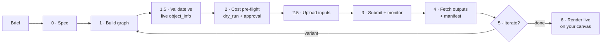

# comfy-cloud-skill


[](LICENSE)

A Claude Code skill that turns a **creative brief into a working ComfyUI pipeline on [Comfy Cloud](https://cloud.comfy.org)**. It designs the graph, validates it against what Cloud actually has installed, shows the cost before anything runs, submits, fetches the results, and finally opens the workflow on your own Comfy canvas for hand-tuning.

> **New to the terms?** A *skill* is a knowledge pack that Claude Code loads when a task calls for it: rules, reference material, and step-by-step procedures. This skill is the *brain*. It executes through the companion MCP server **[comfy-cloud-proxy](https://github.com/niklazhallberg/comfy-cloud-proxy)**, which is the *hands*.

## Why it exists

Generative image and video work in ComfyUI is powerful but fragile. Node graphs break on a missing model. Partner Nodes (paid third-party models) spend money without warning. A result from last month is hard to reproduce. This skill encodes the discipline a careful pipeline operator would apply, so the agent applies it every time:

- **No guessing:** every node and option is checked against Cloud's live catalog before submitting.
- **No surprise bills:** a cost estimate is shown and approved before anything runs, and the proxy enforces a hard ceiling.
- **No lost work:** every run writes a manifest (workflow, seed, parameters, cost), so it can be re-created.
- **No black box:** the final hand-off is the live graph on your Comfy canvas, not an opaque file.

## How it works



Each phase has an explicit definition of done ([`references/pipeline-phases.md`](references/pipeline-phases.md)). Thirteen operational rules are non-negotiable. For example: API format only, validate before submit, explicit seeds, a manifest per run, and never forwarding the API key on redirects ([`references/operational-rules.md`](references/operational-rules.md)).

**Supported pipeline shapes:** txt2img (SD1.5 / SDXL / Flux / Qwen), img2img, inpainting, ControlNet, LoRA stacks, SDXL refiner, multi-pass upscale, AnimateDiff, Wan 2.2 i2v, LTX-Video.

### Example session

> **You:** Make four variations of a ceramic mug on a concrete surface, soft morning light, Flux Dev, 1024×1024.
>
> **Claude:** *(Phase 0–1)* builds a Flux Dev txt2img graph with four locked seeds. *(1.5)* confirms the checkpoint, sampler and scheduler exist on Cloud. *(2)* runs a dry run and reports the estimated cost ("no Partner Nodes, GPU only — OK to submit?") *(3–4)* submits, waits, and saves four PNGs plus a manifest. *(6)* opens the graph in your Comfy Cloud tab so you can tweak it by hand.

## Install

Requirements: [Claude Code](https://claude.com/claude-code), a [Comfy Cloud](https://cloud.comfy.org) account, and the [comfy-cloud-proxy](https://github.com/niklazhallberg/comfy-cloud-proxy#quick-start) MCP server. The [Playwright MCP](https://github.com/microsoft/playwright-mcp) is optional and only needed for Phase 6.

```bash
git clone https://github.com/niklazhallberg/comfy-cloud-skill.git \
  ~/.claude/skills/comfy-cloud-pipeline-designer
```

Claude Code discovers skills in `~/.claude/skills/` automatically. There is nothing to enable. Verify it in a new session:

```
What does the comfy-cloud-pipeline-designer skill do?
```

> The repo is named `comfy-cloud-skill`. The skill's own name, `comfy-cloud-pipeline-designer`, describes what it does and is the name Claude sees.

## Design decisions

- **Two sources of truth, ranked.** Comfy Cloud's public OpenAPI spec wins over the upstream ComfyUI spec, which wins over community and AI research. Conflicts are logged explicitly in [`references/conflicts-and-limitations.md`](references/conflicts-and-limitations.md) instead of being silently resolved.
- **Validate against the live instance, not memory.** Model files and node packs on Cloud change, so the skill checks `/api/object_info` before every submit rather than trusting training data.
- **Cost is enforced twice.** The skill surfaces an estimate and asks, and the proxy independently refuses anything over `max_cost_usd`.
- **Patterns, not templates.** The repo ships generalizable patterns. Concrete workflows belong to the project that uses them, so client work never leaks into a public skill.
- **Research is append-only.** Raw research in [`research/`](research/) is never edited. It is synthesized into [`references/`](references/), so every claim can be traced to a source.
- **The skill learns, with a human gate.** New gotchas found in real sessions are proposed, approved, written into `references/`, and logged in the CHANGELOG ([growth protocol](references/_growth-protocol-pointer.md)).

## Scope & limitations

- **Comfy Cloud only.** Self-hosted ComfyUI, A1111, Forge and similar tools are out of scope.
- **Outputs are non-deterministic** across model and node versions, even with a fixed seed. Manifests make re-runs as close as possible, not identical.
- **Cost estimates are upper bounds.** Actual billing comes from Comfy Cloud.
- No custom node installation. Only nodes that Cloud has pre-installed are available.
- Phase 6 relies on a Comfy Cloud front-end API (`app.loadGraphData`) that is not officially documented and may change.

## Repository layout

```
comfy-cloud-skill/
├── SKILL.md                  # Entry point Claude loads: triggers, phases, operational rules, reference index
├── references/               # Synthesized working knowledge, loaded on demand (16 files)
│   ├── pipeline-phases.md        # Phase 0–6 procedure + definition of done
│   ├── operational-rules.md      # Rules 1–12 with rationale (rule 13 → canvas-render)
│   ├── pipeline-patterns.md      # Graph shapes per pipeline type
│   ├── workflow-authoring-style.md
│   ├── mcp-tool-schemas.md       # Contract with comfy-cloud-proxy
│   ├── api-endpoints.md · websocket-protocol.md · workflow-format.md
│   ├── cost-and-concurrency.md · errors-and-limits.md · partner-nodes.md
│   ├── pre-installed-nodes.md · asset-management.md
│   ├── canvas-render-via-playwright.md · conflicts-and-limitations.md
│   └── _growth-protocol-pointer.md
├── scripts/
│   ├── canvas_to_api.py          # Canvas-format → API-format converter with schema validation
│   └── session-sync-hook.sh      # Flags when accumulated learnings need consolidation
├── research/                 # Append-only raw sources (OpenAPI specs, AI deep-research reports)
├── SKILL-DISCOVERIES.md      # Learnings saved for later review
├── CHANGELOG.md · CONTRIBUTING.md · LICENSE
```

## Related

- **[comfy-cloud-proxy](https://github.com/niklazhallberg/comfy-cloud-proxy)**: the MCP server this skill executes through
- [Comfy Cloud](https://cloud.comfy.org) · [ComfyUI](https://github.com/comfyanonymous/ComfyUI) · [Claude Code skills](https://docs.claude.com/en/docs/claude-code/skills)

See [CHANGELOG.md](CHANGELOG.md) for version history and [CONTRIBUTING.md](CONTRIBUTING.md) for conventions.

## License & contact

[MIT](LICENSE) © Niklaz Hallberg · [niklaz.a.hallberg@gmail.com](mailto:niklaz.a.hallberg@gmail.com)
